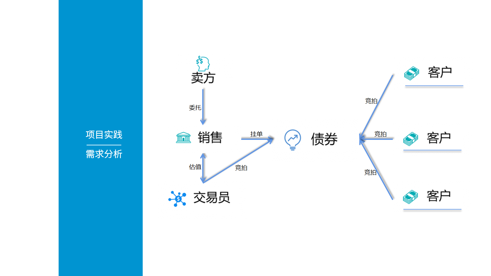
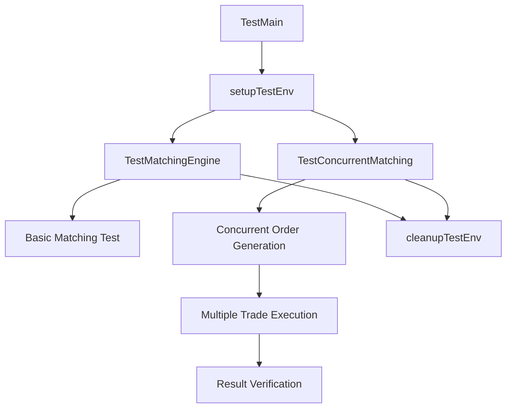

# 在线证券交易系统（`e-bidding system`）

## 总体需求分析



### 角色定义与互动流程

#### 角色定义

| 角色     | 职责                         | 典型操作场景                                                                 |
|----------|-----------------------------|------------------------------------------------------------------------------|
| 卖方 <br> seller | 个人投资者或机构投资者，进行金融产品交易、查询账户信息等。           | - 注册/登录 <br>- 查看股票行情 <br>- 下单（卖出） <br>- 修改订单 <br>- 查询持仓与交易记录 <br>- 删除订单 <br>- 审批订单草稿（由销售提供） |
| 客户 <br> （买方） <br> client | 个人投资者或机构投资者，进行金融产品交易、查询账户信息等。    | - 注册/登录 <br>- 查看股票行情 <br>- 下单（迈ru） <br>- 修改订单 <br>- 查询持仓与交易记录 <br>- 删除订单 |
| 销售 <br> sales | 金融机构的客户经理，负责客户关系维护、产品推荐、开户审核等。         | - 审核客户资质<br>- 处理客户咨询 <br>- 生成客户分析报告 <br>- 推送金融产品信息 <br>- 向卖方提供订单草稿 <br>- 修改/删除订单草稿 |
| 交易员 <br> trader | 金融机构的专业人员，负责执行大额交易、风险控制、市场分析等。       | - 监控市场行情<br>- 手动执行大宗交易<br>- 管理订单队列<br>- 风险预警与干预   |

#### 角色间互动流程

1. 客户 ↔ 销售  
   - 客户通过销售完成开户、资质审核。
   - 销售向客户推荐金融产品，处理投诉或咨询。
   - 后端功能：客户信息管理、审核状态更新、消息推送（如邮件/站内信）。

2. 客户 ↔ 交易系统  
   - 客户提交订单（买入/卖出），系统自动撮合或转交交易员处理。
   - 后端功能：订单处理、实时行情推送、交易记录存储。

3. 交易员 ↔ 系统  
   - 交易员监控订单队列，手动干预（如暂停交易、调整价格）。
   - 后端功能：订单队列管理、风险控制（如熔断机制）、市场数据实时分析。

### 项目背景与核心功能

#### 项目背景

这是一个简化的 证券交易系统，模拟以下场景：

- 客户通过前端（Angular）进行股票交易，销售通过后台管理系统处理客户请求。
- 交易员通过专业终端监控市场，执行复杂交易策略。
- 系统需满足高并发、低延迟、数据一致性要求。

#### 核心功能模块

| 模块           | 功能点                                                                 | 技术实现要点（Go Fiber）                                                    |
|----------------|----------------------------------------------------------------------|-----------------------------------------------------------------------------|
| 用户管理   | 客户注册/登录、角色权限控制（客户/销售/交易员）                        | - JWT 认证<br>- RBAC 权限模型（如 `casbin` 库）                             |
| 订单系统   | 下单、撤单、订单状态查询                                               | - 数据库事务（GORM）<br>- 订单撮合逻辑（市价单/限价单）                     |
| 行情服务   | 实时股票价格推送、历史数据查询                                         | - WebSocket/SSE 实时推送<br>- 第三方数据API集成（如腾讯证券）               |
| 风险管理   | 账户余额校验、交易熔断机制                                             | - 定时任务（如 `cron` 库）<br>- 分布式锁（`Redis`）                           |
| 报表系统   | 生成客户交易报告、销售业绩统计                                         | - 数据聚合查询（SQL）<br>- Excel/PDF 导出（如 `excelize` 库）               |

---

## 项目结构

### 项目文件结构

```tree
backendDev/
├── bin/                               # 编译后的二进制文件
│   └── api                               # API服务器二进制文件
│
├── cmd/                               # 应用程序入口点
│   └── api/						            # 应用程序入口点
│       └── main.go                          # 主函数（应用程序启动、依赖注入配置）
│
├── configs/                           # 配置文件
│   ├── app.yaml                          # 应用配置文件
│   ├── test.yaml                         # 测试环境配置
│   └── production.yaml              		# 生产环境配置
│
├── internal/                          # 私有应用程序代码
│   ├── app/                              # 应用层
│   │   ├── container/                       # 依赖注入容器 package container
│   │   │   ├── container.go               	   # 依赖注入容器
│   │   │   └── container_test.go        			# 容器测试
│   │   └── config/					            # package config 对应原项目 ./config/*
│   │       ├── config.go                 		# 配置加载
│   │       ├── config_test.go             		# 配置测试
│   │       ├── database.go                		# 数据库配置
│   │       └── database_test.go           		# 数据库配置测试
│   │
│   ├── domain/                           # 领域层
│   │   ├── entity/                          # 领域实体 package entity 对应原项目 ./models/*
│   │   │   ├── order.go                   		# 订单实体
│   │   │   ├── order_test.go              		# 订单实体测试
│   │   │   ├── user.go                    		# 用户实体
│   │   │   ├── user_test.go               		# 用户实体测试
│   │   │   ├── trade.go                   		# 交易实体
│   │   │   └── trade_test.go              		# 交易实体测试
│   │   │
│   │   ├── repository/               			# 仓储接口 package repository 
│   │   │   ├── order.go                			# 订单仓储接口
│   │   │   └── user.go                    		# 用户仓储接口
│   │   │
│   │   └── matching/                   		# 领域服务（核心业务逻辑） package matching 对应原项目 ./services/matching/matching.go
│   │       ├── engine.go                  		# 撮合引擎
│   │       └── engine_test.go             		# 撮合引擎测试
│   │
│   ├── infrastructure/            	      # 基础设施层
│   │   ├── persistence/                		# 持久化实现
│   │   │   ├── mysql/                     		# package mysql 对应原项目 ./models/* 中的数据库操作部分
│   │   │   │   ├── order_repo.go          			# MySQL 订单仓储实现
│   │   │   │   ├── order_repo_test.go     			# 订单仓储测试
│   │   │   │   ├── user_repo.go           			# MySQL 用户仓储实现
│   │   │   │   └── user_repo_test.go      			# 用户仓储测试
│   │   │   └── redis/						         # package redis
│   │   │       ├── cache.go               			# Redis 缓存实现
│   │   │       └── cache_test.go          			# Redis 缓存测试
│   │   │
│   │   ├── messaging/      				      # 消息队列
│   │   │   └── kafka/						         # package kafka
│   │   │       ├── producer.go            			# Kafka生产者
│   │   │       └── producer_test.go       			# 生产者测试
│   │   │
│   │   └── security/                      	# 安全相关
│   │       └── jwt/							         # package jwt
│   │           ├── token.go               			# JWT 实现
│   │           └── token_test.go          			# JWT 测试
│
│   ├── interfaces/             			   # 接口层
│   │   └── http/                          	# HTTP接口
│   │       ├── dto/                       		# 数据传输对象 package dto 对应原项目 ./services/requests.go
│   │       │   ├── order.go               		# 订单 DTO
│   │       │   └── auth.go                		# 认证 DTO
│   │       │
│   │       ├── handler/                   	   # HTTP 处理器 package handler 对应原项目 ./controllers/*
│   │       │   ├── order.go               		   # 订单处理器
│   │       │   ├── order_test.go         	 	   # 订单处理器测试
│   │       │   ├── auth.go                		   # 认证处理器
│   │       │   └── auth_test.go           		   # 认证处理器测试
│   │       │
│   │       ├── middleware/                		# HTTP 中间件 package middleware
│   │       │   ├── auth.go                			# 认证中间件
│   │       │   ├── auth_test.go           			# 认证中间件测试
│   │       │   ├── http_logger.go         			# HTTP 日志中间件
│   │       │   └── rate_limit.go          			# 限流中间件
│   │       │
│   │       └── router/                    		# 路由配置 package router
│   │           ├── router.go              			# 路由注册
│   │           └── router_test.go         			# 路由测试
│   │
│   └── usecase/             			      # 用例层（替代原 application 层）
│       ├── order/                         	# package orderusecase 对应原项目 ./services/order/order_service.go
│       │   ├── service.go                 		# 订单用例
│       │   ├── service_test.go            		# 订单用例测试
│       │   └── dto.go                     		# 内部 DTO
│       └── auth/						            # package authusecase 对应原项目 ./services/user/user_service.go
│           ├── service.go                 		# 认证用例
│           └── service_test.go            		# 认证用例测试
│
├── pkg/                               # 公共代码包 对应原项目 ./utils/*
│   ├── logger/					            # 日志 package logger 
│   │   ├── logger.go                      	# 日志接口定义
│   │   └── zap.go                        	# Zap实现
│   ├── errors/					            # 错误 package errors
│   │   ├── errors.go                      	# 错误接口定义
│   │   └── impl.go                        	# 错误实现
│   └── utils/						            # 通用工具
│       ├── validator.go                   	# package utils - 通用验证
│       └── time.go                        	# package utils - 时间工具
│
├── tests/                             # 集成测试和 E2E 测试
│   ├── integration/                      # 集成测试
│   │   └── api/						            # package integration
│   │       └── order_flow_test.go         		# 订单流程测试
│   │
│   └── e2e/                              # 端到端测试 package e2e
│       └── trading_flow_test.go           	# 交易流程测试
│
├── build/                             # 构建相关
│   ├── Dockerfile                        # Docker 构建文件
│   └── docker-compose.yml                # 容器编排配置
│
├── deployments/                       # 部署配置
│   ├── kubernetes/                    	# K8s 配置
│   └── terraform/                        # 基础设施即代码
│
├── docs/                              # 文档
│   ├── api/						            # API 文档
│   │   └── swagger.yaml                   	# swagger 文档
│   └── architecture/				         # 架构设计
│       └── design.md                      	# 架构设计文档
│
├── scripts/                           # 脚本
│   ├── build.sh                          # 构建脚本
│   └── deploy.sh                         # 部署脚本
│
├── magefile.go                        # 项目管理命令
├── go.mod                                # Go 模块定义
├── go.sum                                # 依赖版本锁定
└── README.md                          # 项目说明
```

### `CSM` 分层

> `controller` - `service` - `model`

#### `controller`

处理 HTTP 请求，调用 `service` 层逻辑

基础控制器封装通用请求解析和校验。

#### `service`

实现业务逻辑，调用 `model` 层操作数据库

通过 `QueryCondition` 实现动态查询，`validateOrderRequest` 复用校验逻辑。

#### `model`

定义数据模型，提供数据库操作方法

### 主函数核心流程

1. 加载环境变量：读取 `.env` 文件中的配置

2. 数据库初始化并连接：通过 GORM 初始化 MySQL 连接，将 `models` 包中的结构体迁移为数据库表

3. 初始化 Fiber 应用

4. 注册全局中间件：异常恢复、跨域请求、配置请求日志中间件和全局错误处理中间件

5. 注册路由（依赖注入）：调用 `routes.SetupRoutes(app)` 绑定 API 路径

6. 启动撮合引擎：启动后捕获系统信号，用于优雅关闭

7. 启动服务器：监听指定端口（如 3000），并输出启动信息

### 路由

对路由使用了 `RESTful` 规范化实践

```go
// 公共路由：
public := app.Group("/api")
{
   public.Post("/register", authController.Register)
   public.Post("/login", authController.Login)
}
// 初始化 JWT 中间件：
jwtMiddleware := jwtware.New(jwtware.Config{
   SigningKey: jwtware.SigningKey{
      Key: []byte(config.Get("JWT_SECRET")),
   },
}  
// 认证路由组：
authenticated := app.Group("/api", jwtMiddleware)
{
   // 所有认证用户均可调用：
   authenticated.Post("/logout", authController.Logout) //登出
   // 卖家路由组：
   seller := authenticated.Group("/seller", middleware.RoleRequired("seller"))
   {
      seller.Post("/orders", sellerController.SellerCreateOrder)                    //创建卖出订单
      seller.Put("/orders/:id", sellerController.SellerUpdateOrder)                 //修改订单
      seller.Delete("/orders/:id", sellerController.SellerCancelOrder)              //单个撤单
      seller.Post("/orders/batch-cancel", sellerController.SellerBatchCancelOrders) //批量撤单
      seller.Get("/orders", sellerController.SellerGetOrders)                       //查看卖家订单
      seller.Post("/authorize/sales", sellerController.SellerAuthorizeSales)        //授权销售
   }
   // 销售路由组：
   sales := authenticated.Group("/sales", middleware.RoleRequired("sales"))
   {
      sales.Get("/orders", salesController.SalesGetAuthorizedDrafts)     //查看已授权草稿
      sales.Post("/drafts", salesController.SalesCreateDraft)            //创建草稿
      sales.Put("/drafts/:id", salesController.SalesUpdateDraft)         //修改草稿
      sales.Post("/drafts/:id/submit", salesController.SalesSubmitDraft) //提交草稿
      sales.Delete("/drafts/:id", salesController.SalesDeleteDraft)      //删除草稿
   }
   // 客户路由组：
   client := authenticated.Group("/client", middleware.RoleRequired("client"))
   {
      client.Get("/orders", clientController.ClientGetOrders)               //查看匿名处理的卖方订单
      client.Post("/orders/:id/buy", clientController.ClientCreateBuyOrder) //对已有的卖方订单创建自己买 订单
   }
   // 交易员路由组：
   trader := authenticated.Group("/trader", middleware.RoleRequired("trader"))
   {
      trader.Get("/orders", traderController.TraderGetAllOrders) // 查看所有订单
      // trader.Post("/orders/:id/cancel", traderController.EmergencyCancel) //手动操作，暂不实现
   }
}
app.Static("/", "./static")
app.Static("/assets", "./static/assets")
```

## 系统架构

- 系统架构图
- 技术选型说明
- 核心模块说明

### 整体架构

- 数据库设计
- 缓存设计
- 数据流图

### 数据架构

- 认证机制
- 授权策略
- 数据安全

### 数据验证

#### 请求验证机制
- 框架：使用 `go-playground/validator`
- 实现层级：
  1. 控制器层：基础格式验证
  2. 服务层：业务规则验证
- 主要验证规则：
  - 用户注册：用户名、密码、角色验证
  - 订单创建：数量、价格、状态验证
  - 授权管理：权限、时效性验证

### 缓存设计

#### Redis 使用方案
- 用途：Token 黑名单管理
- 实现：
  - 使用 Redis 存储已注销的 JWT token
  - Key 格式：`jti:{token}`
  - 过期时间：与 token 剩余有效期一致
- 关键流程：
  1. 用户注销时写入黑名单
  2. 每次请求验证 token 是否在黑名单
  3. 自动过期机制

### 安全架构

### 安全设计

#### 会话管理
- JWT + Redis 双重验证
- Token 自动过期
- 注销即时生效

## 核心业务：订单撮合

撮合逻辑的核心是将买入订单（Buy Order）与卖出订单（Sell Order）**按规则匹配**，更新订单状态并记录成交记录。以下是具体步骤：

### 撮合规则

- 价格优先

   买入订单的 **最高限价** 需 **≥** 卖出订单的 **最低限价。**

   市价单（Market Order）默认匹配所有符合条件的订单。

- 时间优先：

   价格相同的情况下，先提交的订单优先成交。

### 数据库操作步骤

1. 查询未成交订单

   从 orders 表中筛选 status = 'pending' 的买入和卖出订单

2. 排序与匹配

   买入订单按价格 降序、时间 升序 排序

   卖出订单按价格 升序、时间 升序 排序

3. 更新订单状态

   匹配成功后，将订单状态更新为 filled（已成交）

4. 生成成交记录（可选）

   在 `trades` 表中插入成交记录，包含成交价、数量、时间等

### 关键功能点

```text
+---------------------+------------------------------------------------------+
|       功能点        |                       说明                         |
+---------------------+------------------------------------------------------+
| 市价单处理逻辑      | 市价买单以最优卖价成交，市价卖单以最优买价成交         |
| 限价单时间窗口      | 通过matchInterval参数控制限价单的有效期                |
| 浮点数精度容差      | 通过priceTolerance解决浮点数计算精度问题               |
| 内存状态管理        | 在内存中更新数量，减少数据库查询次数                   |
| 订单状态原子更新    | 使用GORM的Select+Updates确保只更新指定字段             |
| 成交记录审计        | 生成完整的成交记录，包含时间戳和价格详情               |
+---------------------+------------------------------------------------------+
```

### 运行时序图



### 函数调用关系

```txt
matching.go
├── MatchOrders (入口函数)主流程控制，协调各子函数
│   ├── isMatchable (匹配检查)检查价格/标的匹配性
│   ├── determineExecutionPrice (定价逻辑)根据订单类型确定成交价
│   └── updateOrder (状态更新)原子化更新订单状态
└── min (辅助函数)返回较小值，一辅助计算成交量
```

---

## 关键工具

### `postman` 请求集合工具

### `Mage` 自动化构建工具

### `Validate` 结构-表 验证工具

### `JWT` 认证工具

### `gsudo` 提权工具

## 设计思想

### `SOLID` 原则

#### `SR` 单一职责

每个控制器函数只处理特定的 HTTP 请求

通用命名如 `GetOrders` 可能导致不同角色的处理逻辑混杂在同一个函数中，而专用命名如 `GetSellerOrders` 则更清晰，但可能增加代码重复。权衡利弊后，专用命名更符合单一职责原则，尽管有一定重复，但提高了可读性和可维护性。

#### `DI` 依赖注入

使用依赖注入将服务实例传入控制器，避免全局变量，提高可测试性。

### RESTful API 设计

遵循 RESTful API 设计原则，将资源路径与 HTTP 方法对应，实现清晰的资源操作。

### 中间件设计

通过中间件实现**权限控制**、**日志记录**等功能，提高代码复用性和可维护性。

### 环境变量管理

使用 .env 文件管理环境变量，方便在不同环境下配置。
