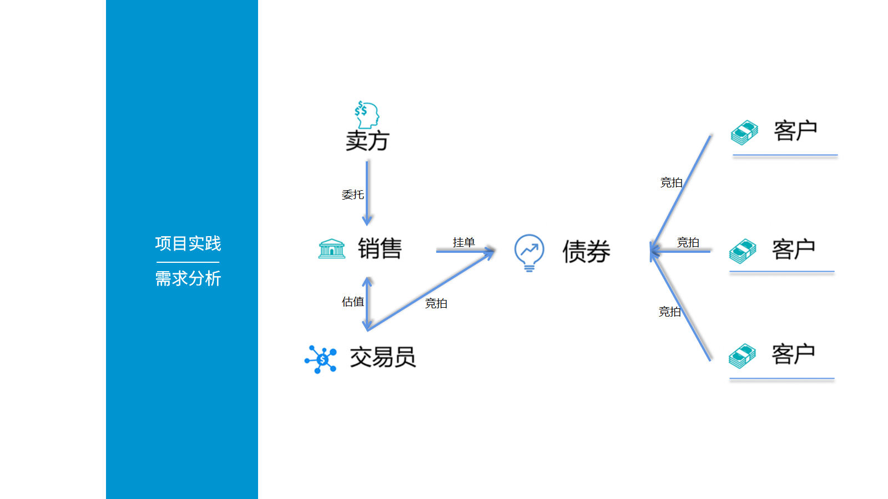

# 项目文档

## 总体需求分析



### 角色定义与互动流程

#### 角色定义

| 角色     | 职责                                                                 | 典型操作场景                                                                 |
|----------|----------------------------------------------------------------------|------------------------------------------------------------------------------|
| 客户 | 个人投资者或机构投资者，进行金融产品交易、查询账户信息等。           | - 注册/登录<br>- 查看股票行情<br>- 下单（买入/卖出）<br>- 查询持仓与交易记录 |
| 销售 | 金融机构的客户经理，负责客户关系维护、产品推荐、开户审核等。         | - 审核客户资质<br>- 处理客户咨询<br>- 生成客户分析报告<br>- 推送金融产品信息 |
| 交易员 | 金融机构的专业人员，负责执行大额交易、风险控制、市场分析等。       | - 监控市场行情<br>- 手动执行大宗交易<br>- 管理订单队列<br>- 风险预警与干预   |

#### 角色间互动流程

1. 客户 ↔ 销售  
   - 客户通过销售完成开户、资质审核。
   - 销售向客户推荐金融产品，处理投诉或咨询。
   - 后端功能：客户信息管理、审核状态更新、消息推送（如邮件/站内信）。

2. 客户 ↔ 交易系统  
   - 客户提交订单（买入/卖出），系统自动撮合或转交交易员处理。
   - 后端功能：订单处理、实时行情推送、交易记录存储。

3. 交易员 ↔ 系统  
   - 交易员监控订单队列，手动干预（如暂停交易、调整价格）。
   - 后端功能：订单队列管理、风险控制（如熔断机制）、市场数据实时分析。

---

### 项目背景与核心功能

#### 项目背景

这是一个简化的 证券交易系统，模拟以下场景：

- 客户通过前端（Angular）进行股票交易，销售通过后台管理系统处理客户请求。
- 交易员通过专业终端监控市场，执行复杂交易策略。
- 系统需满足高并发、低延迟、数据一致性要求。

#### 核心功能模块

| 模块           | 功能点                                                                 | 技术实现要点（Go Fiber）                                                    |
|----------------|----------------------------------------------------------------------|-----------------------------------------------------------------------------|
| 用户管理   | 客户注册/登录、角色权限控制（客户/销售/交易员）                        | - JWT 认证<br>- RBAC 权限模型（如 `casbin` 库）                             |
| 订单系统   | 下单、撤单、订单状态查询                                               | - 数据库事务（GORM）<br>- 订单撮合逻辑（市价单/限价单）                     |
| 行情服务   | 实时股票价格推送、历史数据查询                                         | - WebSocket/SSE 实时推送<br>- 第三方数据API集成（如腾讯证券）               |
| 风险管理   | 账户余额校验、交易熔断机制                                             | - 定时任务（如 `cron` 库）<br>- 分布式锁（Redis）                           |
| 报表系统   | 生成客户交易报告、销售业绩统计                                         | - 数据聚合查询（SQL）<br>- Excel/PDF 导出（如 `excelize` 库）               |

## 项目结构

```tree
backend/
├── config/
│   └── config.go       # 配置文件加载（如 JWT 密钥）
├── models/
│   ├── user.go         # User 模型定义
│   ├── order.go        # Order 模型定义
│   └── stock.go        # Stock 模型定义
├── routes/
│   └── api.go          # 路由定义（/api/*）
├── controllers/
│   ├── auth.go         # 注册/登录逻辑
│   └── order.go        # 订单创建/查询逻辑
├── main.go             # 主入口（初始化 Fiber、数据库）
└── .env                # 环境变量（数据库路径、密钥）
```

### ？

【未完成】
