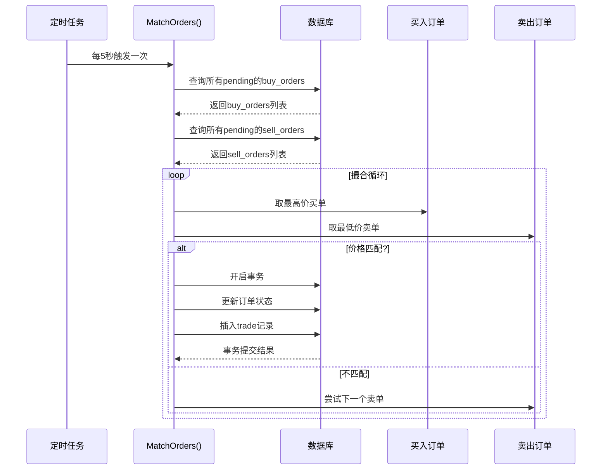

# 项目文档

## 总体需求分析


### 角色定义与互动流程

#### 角色定义

| 角色     | 职责                                                                 | 典型操作场景                                                                 |
|----------|----------------------------------------------------------------------|------------------------------------------------------------------------------|
| 客户 | 个人投资者或机构投资者，进行金融产品交易、查询账户信息等。           | - 注册/登录<br>- 查看股票行情<br>- 下单（买入/卖出）<br>- 查询持仓与交易记录 |
| 销售 | 金融机构的客户经理，负责客户关系维护、产品推荐、开户审核等。         | - 审核客户资质<br>- 处理客户咨询<br>- 生成客户分析报告<br>- 推送金融产品信息 |
| 交易员 | 金融机构的专业人员，负责执行大额交易、风险控制、市场分析等。       | - 监控市场行情<br>- 手动执行大宗交易<br>- 管理订单队列<br>- 风险预警与干预   |

#### 角色间互动流程

1. 客户 ↔ 销售  
   - 客户通过销售完成开户、资质审核。
   - 销售向客户推荐金融产品，处理投诉或咨询。
   - 后端功能：客户信息管理、审核状态更新、消息推送（如邮件/站内信）。

2. 客户 ↔ 交易系统  
   - 客户提交订单（买入/卖出），系统自动撮合或转交交易员处理。
   - 后端功能：订单处理、实时行情推送、交易记录存储。

3. 交易员 ↔ 系统  
   - 交易员监控订单队列，手动干预（如暂停交易、调整价格）。
   - 后端功能：订单队列管理、风险控制（如熔断机制）、市场数据实时分析。

### 项目背景与核心功能

#### 项目背景

这是一个简化的 证券交易系统，模拟以下场景：

- 客户通过前端（Angular）进行股票交易，销售通过后台管理系统处理客户请求。
- 交易员通过专业终端监控市场，执行复杂交易策略。
- 系统需满足高并发、低延迟、数据一致性要求。

#### 核心功能模块

| 模块           | 功能点                                                                 | 技术实现要点（Go Fiber）                                                    |
|----------------|----------------------------------------------------------------------|-----------------------------------------------------------------------------|
| 用户管理   | 客户注册/登录、角色权限控制（客户/销售/交易员）                        | - JWT 认证<br>- RBAC 权限模型（如 `casbin` 库）                             |
| 订单系统   | 下单、撤单、订单状态查询                                               | - 数据库事务（GORM）<br>- 订单撮合逻辑（市价单/限价单）                     |
| 行情服务   | 实时股票价格推送、历史数据查询                                         | - WebSocket/SSE 实时推送<br>- 第三方数据API集成（如腾讯证券）               |
| 风险管理   | 账户余额校验、交易熔断机制                                             | - 定时任务（如 `cron` 库）<br>- 分布式锁（Redis）                           |
| 报表系统   | 生成客户交易报告、销售业绩统计                                         | - 数据聚合查询（SQL）<br>- Excel/PDF 导出（如 `excelize` 库）               |

---

## 项目结构

```tree
backend/
├── bin/                   # 编译输出目录
│   ├── ebidsystem.exe        # 可执行文件
│   └── logs                  # 日志目录
│       ├── service.log          # 存放 HTTP 请求、错误日志等通用日志
│       ├── error.log            # 单独记录错误级别的日志（可通过日志库的 Level 过滤）
│       └── match.log            # 存放撮合引擎业务日志
├── config/                # 配置管理
│   └── config.go             # 读取环境变量
├── controllers/           # 控制器（处理 HTTP 请求）
│   ├── auth.go               # 专注认证与授权逻辑（注册/登录/注销）
│   ├── client.go             # 客户相关功能
│   ├── common.go             # 公共控制器（与业务无关的通用工具，如对数据库/JWT/错误的处理）
│   ├── order.go              # 订单创建、查询、取消
│   ├── sales.go              # 销售相关功能（草稿、提交审批）
│   ├── seller.go             # 卖家授权管理
│   └── trader.go             # 交易员授权管理
├── middleware/            # 中间件定义
│   ├── auth.go               # 角色权限校验中间件（如 SellerOnly, SalesOnly）
│   ├── jwt.go                # JWT 认证中间件
│   └── logging.go            # 请求日志中间件
├── models/                # 数据模型定义
│   ├── user.go               # 用户模型
│   ├── order.go              # 订单模型
│   ├── stock.go              # 股票模型（暂不实现）
│   ├── trades.go             # 成交信息（撮合成功后）
│   └── authorization.go      # 卖家-销售授权模型（已定义在 ./user.go 中，暂不独立出来）
├── routes/                # 路由定义
│   └── api.go                # API 路由注册
├── services/              # 核心业务逻辑
│   ├── matching.go           # 订单撮合引擎
│   └── order.go              # 订单状态管理
├── .env                   # 环境变量（开发环境配置）
├── go.mod                 # Go 模块依赖
├── go.sum                 # 依赖校验
├── main.go                # 应用入口（初始化、启动服务）
└── magefile.go            # 自动化构建文件（取得管理员权限+授权通过防火墙+编译+运行+输出日志）
```

### 主函数核心流程

1. 加载环境变量：读取 .env 文件中的配置（如数据库连接信息）

2. 连接数据库：通过 GORM 初始化 MySQL 连接

3. 自动迁移表结构：根据 models 包中的结构体（如 User、Order）创建数据库表

4. 初始化 Fiber 应用：注册全局中间件（如跨域、日志、异常恢复）

5. 注册路由：调用 routes.SetupRoutes(app) 绑定 API 路径

6. 启动服务：监听指定端口（如 3000）

### 批处理文件功能

取得管理员权限+授权通过防火墙+编译+运行+输出日志

### 路由

对路由使用了 `RESTful` 规范化实践

```go
// 认证路由组：
authenticated := app.Group("/api", jwtMiddleware)
{
   // 卖家角色路由组：
   seller := authenticated.Group("/seller", middleware.SellerOnly)
   {
      seller.Post("/orders", controllers.CreateSellOrder)         // 创建卖出订单
      seller.Put("/orders/:id", controllers.UpdateOrder)          // 修改订单
      seller.Post("/orders/:id/cancel", controllers.CancelOrder)  // 取消订单
      seller.Get("/orders", controllers.GetSellerOrders)          // 查看卖家订单
      seller.Post("/authorize/sales", controllers.AuthorizeSales) // 授权销售
   }
   // 销售角色路由组：
   sales := authenticated.Group("/sales", middleware.SalesOnly)
   {
      sales.Get("/orders", controllers.GetAuthorizedOrders)     // 查看已授权订单
      sales.Post("/drafts", controllers.CreateDraftOrder)       // 创建订单草稿
      sales.Put("/drafts/:id", controllers.UpdateDraftOrder)    // 修改草稿
      sales.Post("/drafts/:id/submit", controllers.SubmitDraft) // 提交草稿
   }
   // 客户角色路由组：
   client := authenticated.Group("/client")
   {
      client.Post("/orders", controllers.CreateBuyOrder) // 创建买入订单
      client.Get("/orders", controllers.GetClientOrders) // 查看客户订单
   }
   // 交易员角色路由组：
   trader := authenticated.Group("/trader", middleware.TraderOnly)
   {
      trader.Get("/orders", controllers.GetAllOrders) // 查看所有订单
   }
}
```

## 核心业务：订单撮合

撮合逻辑的核心是将买入订单（Buy Order）与卖出订单（Sell Order）**按规则匹配**，更新订单状态并记录成交记录。以下是具体步骤：

### 撮合规则

- 价格优先

   买入订单的 **最高限价** 需 **≥** 卖出订单的 **最低限价。**

   市价单（Market Order）默认匹配所有符合条件的订单。

- 时间优先：

   价格相同的情况下，先提交的订单优先成交。

### 数据库操作步骤

1. 查询未成交订单

   从 orders 表中筛选 status = 'pending' 的买入和卖出订单

2. 排序与匹配

   买入订单按价格 降序、时间 升序 排序

   卖出订单按价格 升序、时间 升序 排序

3. 更新订单状态

   匹配成功后，将订单状态更新为 filled（已成交）

4. 生成成交记录（可选）

   在 `trades` 表中插入成交记录，包含成交价、数量、时间等

### 关键功能点

```text
+---------------------+------------------------------------------------------+
|       功能点        |                       说明                         |
+---------------------+------------------------------------------------------+
| 市价单处理逻辑      | 市价买单以最优卖价成交，市价卖单以最优买价成交         |
| 限价单时间窗口      | 通过matchInterval参数控制限价单的有效期                |
| 浮点数精度容差      | 通过priceTolerance解决浮点数计算精度问题               |
| 内存状态管理        | 在内存中更新数量，减少数据库查询次数                   |
| 订单状态原子更新    | 使用GORM的Select+Updates确保只更新指定字段             |
| 成交记录审计        | 生成完整的成交记录，包含时间戳和价格详情               |
+---------------------+------------------------------------------------------+
```

### 运行时序图



### 函数调用关系

```txt
matching.go
├── MatchOrders (入口函数)主流程控制，协调各子函数
│   ├── isMatchable (匹配检查)检查价格/标的匹配性
│   ├── determineExecutionPrice (定价逻辑)根据订单类型确定成交价
│   └── updateOrder (状态更新)原子化更新订单状态
└── min (辅助函数)返回较小值，一辅助计算成交量
```

---

## 设计思想

### RESTful API 设计

遵循 RESTful API 设计原则，将资源路径与 HTTP 方法对应，实现清晰的资源操作。

### 中间件设计

通过中间件实现权限控制、日志记录等功能，提高代码复用性和可维护性。

### 环境变量管理

使用 .env 文件管理环境变量，方便在不同环境下配置。

### SoC 职责分离原则

将不同职责的代码分离到不同的包中，实现单一职责原则，提高代码的可维护性和可扩展性。

#### controller-service-model

- controller：处理 HTTP 请求，调用 service 层逻辑
- service：实现业务逻辑，调用 model 层操作数据库
- model：定义数据模型，提供数据库操作方法
